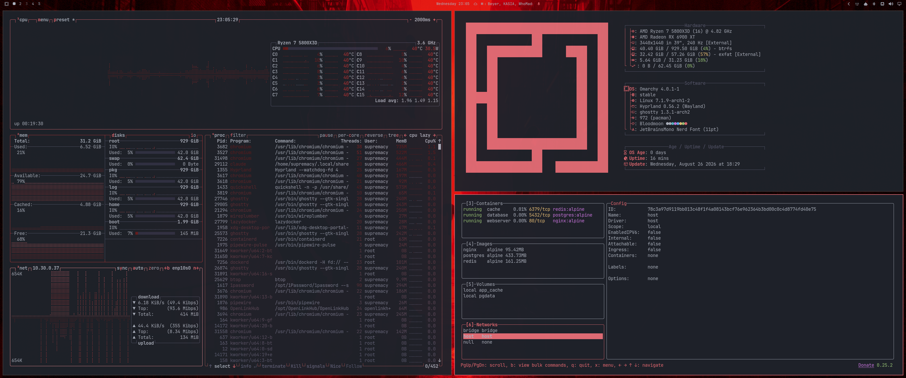

# Omarchy Bloodmoon Theme

Bloodmoon is a dark, blood-red theme derived from the [Yamura](https://zed.dev/extensions/yamura)
Zed editor theme: near-black surfaces, cool gray text, and a single coral-red
accent carried through every app instead of a rainbow of unrelated hues.

## Preview



## Install

Use the Omarchy theme installer:

```bash
omarchy theme install https://github.com/supremacyvx/omarchy-bloodmoon-theme
```

## What's Included

- `colors.toml` — the core palette. Themes Hyprland, the Omarchy shell,
  Alacritty/Foot/Ghostty/Kitty, btop, Chromium, Neovim, Helix, VSCode,
  Obsidian, and Claude Code automatically.
- `icons.theme` — `Yaru-red-dark` to match the accent.
- `btop.theme` — a hand-tuned monochrome-red override (the auto-generated
  version from `colors.toml` leaned too purple/green for this theme's taste).
- `lazydocker/config.yml` — lazydocker only supports the 8 named ANSI colors
  (no hex), so this sets `red`/`bold` for borders and highlights. Since it
  references the named color rather than a hex value, it automatically
  matches whichever theme's red is active in your terminal.
- `fastfetch/config.jsonc` — fastfetch supports true 24-bit color, so every
  section is repainted with the theme's accent (`#e06c75`) instead of the
  stock green/blue/magenta.

## Wallpapers

<table>
  <tr>
    <td></td>
    <td></td>
  </tr>
</table>

## Notes

lazydocker and fastfetch aren't apps Omarchy themes natively, so `omarchy theme
install` won't wire those two up for you — copy `lazydocker/config.yml` to
`~/.config/lazydocker/config.yml` and `fastfetch/config.jsonc` to
`~/.config/fastfetch/config.jsonc` by hand.
